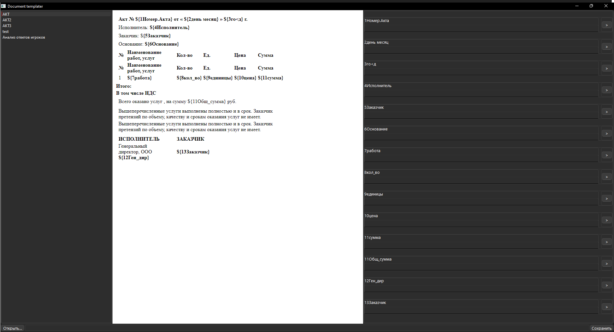

# Шаблонизатор word документов  
### Подготовка
Запустите программу она создаст необходимые файлы для работы  
Папки templates, result
Файл data.xlsx
### Подготовка шаблона  
Нужные для замены строки заменить на ${1название_параметра}  
Для того что бы параметры шли по порядку пронумеруйте их, цифра должна быть первой в названии.
### Подготовка полей автозаполнения
Данные нужно внести в таблицу в excel файл data.xlsx по следующему формату  

### Начало работы
Переместите шаблон в папку templates, рядом с программой и запустите программу 
или перетащите его в левую часть программы, отмеченную красным прямоугольником на фото  

Программа создаст копию шаблона в папке templates  
Двойным кликом по названию шаблона откройте его.  
Для автозаполнения кликните на стрелочку рядом с полем, и выберите нужный вариант  
Заполните поля, и нажмите сохранить, файл будет сохранён в выбранной вами директории

